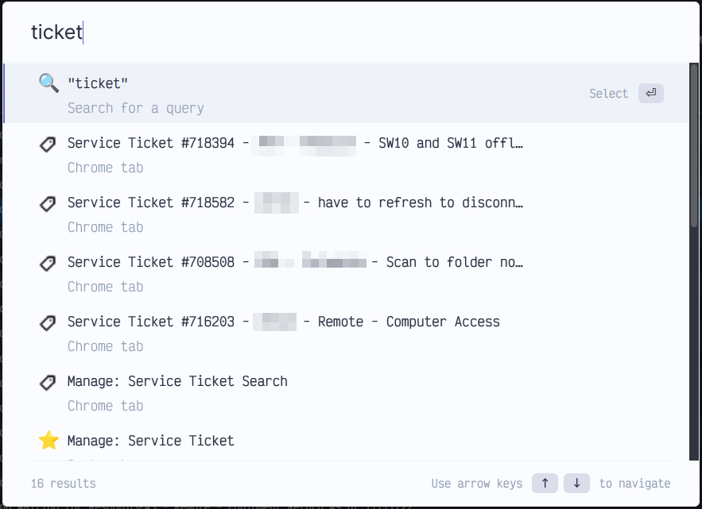

# peakeutils
Custom utilities that aid in productivity

## Userscript: connectwise-manage-tab-title.user.js
A userscript that dynamically sets the browser tab title based on the current page heading in Connectwise Manage

Before:


After:


Example with [Omni](https://github.com/alyssaxuu/omni) Browser Extension to search through open tabs:



### Installation
Install a userscript extension like [ViolentMonkey](https://violentmonkey.github.io) or [TamperMonkey](https://www.tampermonkey.net) *(untested)*.
Create a new script in the extension, copy and paste the [script content](connectwise-manage-tab-title.user.js) into the new script.
Set the @match variable to the base Url of your Manage instance. Ex: `@match https://manage.mydomain.tld/*`

## Quick Search URLs
Used in your browser to quickly lookup tickets & search for computers. [Details](quicksearch-urls.md)

## LastPass CLI util: lp-fzf
Search LastPass on the commandline, then copy password to clipboard. 1000% faster than using the web ui/extension.

Requires: WSL/Linux/Mac, [lastpass-cli](https://github.com/lastpass/lastpass-cli), [fzf](https://github.com/junegunn/fzf)

*Note:* on WSL, you may need to use https://github.com/Konfekt/win-bash-xclip-xsel for Windows clipboard integration. Installation script to come.

## Powershell Script: download-from-github.ps1
Powershell script to download (and optionally, run) other powershell scripts from any URL or GitHub repo. Downloading from a private GitHub repo requires a repo token.

Usage:
```powershell
.\download-from-github.ps1 [-Url "https://domain.tld/file.ps1"] | ([-Path "user/repo/branch/file.ps1"] [-Token "github_token"]) [-Run] [-Params "-Arguments 'to pass to' -Downloaded 'script'"]
```
Example:

```powershell
.\download-from-github.ps1 -Path "PEAKE-Technology-Partners/peakeutils/powershell/test.ps1" -Token "ghp_xxxxxxxxxxxxxxxxxx" -Run -Params "-Name Jon"
```

Output:
`Hello, Jon`

### Bonus
Here's a one-liner that will download & run the `download-from-github.ps1` script, which in turn downloads and runs the [powershell/test.ps1](powershell/test.ps1) script and passes arguments to it -- all without touching the filesystem:
```powershell
icm -ScriptBlock ([scriptblock]::create("&{ $(irm "https://raw.githubusercontent.com/PEAKE-Technology-Partners/peakeutils/main/download-from-github.ps1") } -Url 'https://raw.githubusercontent.com/PEAKE-Technology-Partners/peakeutils/main/powershell/test.ps1' -Run -Params '-Name `"PEAKE Technology Partners`" -GetDate'"))
```

Output:
```
hello PEAKE Technology Partners

Saturday, November 12, 2022 7:27:10 PM
```
